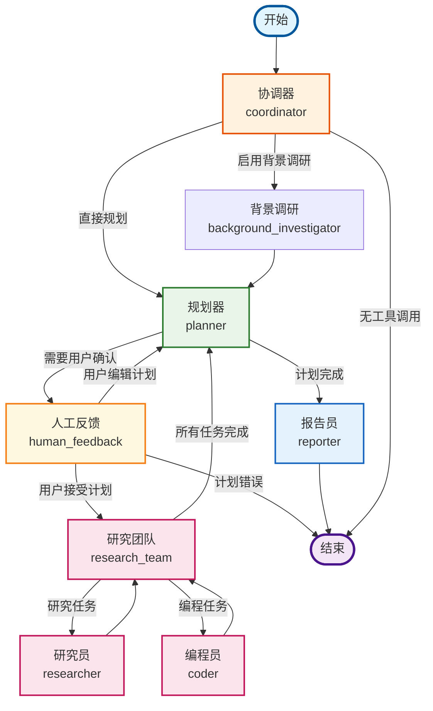
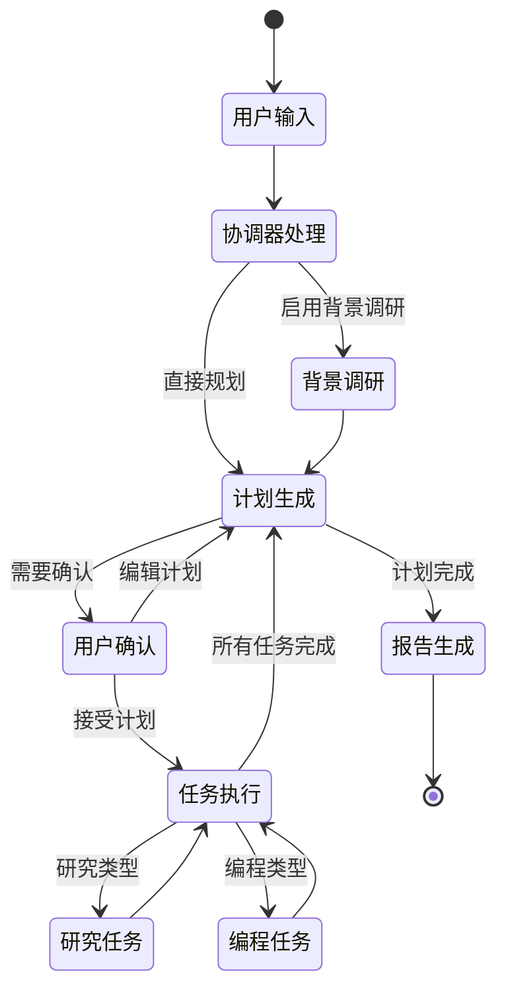

# Deer Flow 详细工作流程图

## 概述
这是Deer Flow项目的详细LangGraph工作流程图，包含所有节点、连接关系和条件分支的详细说明。

## 主流程图



## 条件分支详细说明

### 1. 协调器节点 (coordinator)
- **输入**: 用户查询
- **输出**: 
  - 如果启用背景调研 → `background_investigator`
  - 如果直接规划 → `planner`
  - 如果无工具调用 → `__end__`

### 2. 规划器节点 (planner)
- **输入**: 研究主题和背景信息
- **输出**:
  - 如果计划迭代次数达到上限 → `reporter`
  - 如果计划有足够上下文 → `reporter`
  - 如果计划需要用户确认 → `human_feedback`
  - 如果JSON解析错误 → `__end__`

### 3. 人工反馈节点 (human_feedback)
- **输入**: 用户反馈
- **输出**:
  - 如果用户编辑计划 → `planner`
  - 如果用户接受计划 → `research_team`
  - 如果计划错误且迭代次数>1 → `reporter`
  - 如果计划错误且迭代次数≤1 → `__end__`

### 4. 研究团队节点 (research_team)
- **输入**: 当前计划
- **输出**:
  - 如果没有未完成的步骤 → `planner`
  - 如果下一步是研究任务 → `researcher`
  - 如果下一步是编程任务 → `coder`

## 状态流转图



## 节点功能详细说明

### 协调器 (coordinator)
- **功能**: 与用户交互，理解研究需求
- **工具**: `handoff_to_planner`
- **输出状态**: `locale`, `research_topic`, `resources`

### 背景调研 (background_investigator)
- **功能**: 收集研究主题的背景信息
- **工具**: 网络搜索工具
- **输出状态**: `background_investigation_results`

### 规划器 (planner)
- **功能**: 生成详细的研究计划
- **输入**: 研究主题、背景信息、用户消息
- **输出**: `Plan` 对象或JSON字符串
- **条件**: 根据计划迭代次数和内容质量决定下一步

### 人工反馈 (human_feedback)
- **功能**: 等待用户审核和确认计划
- **交互**: 支持 `[EDIT_PLAN]` 和 `[ACCEPTED]` 指令
- **状态更新**: `plan_iterations`, `current_plan`

### 研究团队 (research_team)
- **功能**: 协调研究任务的执行
- **逻辑**: 查找第一个未完成的步骤并分发到相应节点

### 研究员 (researcher)
- **功能**: 执行研究任务
- **工具**: 网络搜索、爬虫、本地检索
- **输出**: 研究结果添加到 `observations`

### 编程员 (coder)
- **功能**: 执行代码分析和处理
- **工具**: Python REPL
- **输出**: 代码执行结果添加到 `observations`

### 报告员 (reporter)
- **功能**: 生成最终研究报告
- **输入**: 所有观察结果和计划信息
- **输出**: `final_report`

## 状态管理

### State 类字段
```python
class State(MessagesState):
    locale: str = "en-US"                    # 用户语言环境
    research_topic: str = ""                 # 研究主题
    observations: list[str] = []             # 观察结果列表
    resources: list[Resource] = []           # 资源列表
    plan_iterations: int = 0                 # 计划迭代次数
    current_plan: Plan | str = None          # 当前计划
    final_report: str = ""                   # 最终报告
    auto_accepted_plan: bool = False         # 是否自动接受计划
    enable_background_investigation: bool = True  # 是否启用背景调研
    background_investigation_results: str = None  # 背景调研结果
```

## 错误处理

### 常见错误场景
1. **JSON解析错误**: 规划器输出格式错误时的处理
2. **计划迭代超限**: 防止无限循环的保护机制
3. **工具调用失败**: 网络搜索或代码执行失败的处理
4. **用户中断**: 用户取消操作的处理

### 恢复机制
- 计划迭代次数限制
- 自动回退到报告生成
- 错误状态下的优雅终止

---
*此详细流程图由LangGraph自动生成并人工增强*
