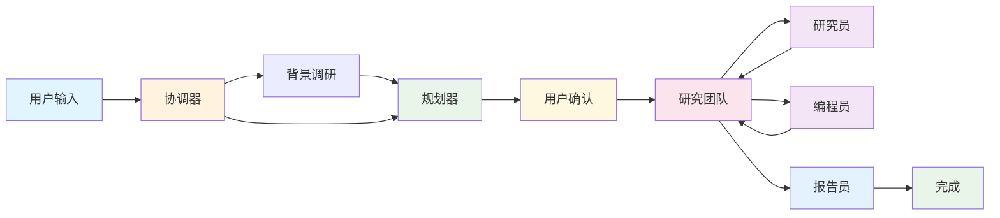

# Deer Flow 核心工作流程图

## 简化流程图

## 核心流程说明

### 1. 用户交互阶段
- **协调器**: 理解用户需求，确定研究方向
- **背景调研**: 收集相关背景信息（可选）

### 2. 计划制定阶段
- **规划器**: 基于需求和背景信息生成研究计划
- **用户确认**: 用户审核和确认计划

### 3. 任务执行阶段
- **研究团队**: 协调任务分发
- **研究员**: 执行研究任务
- **编程员**: 执行编程任务

### 4. 结果输出阶段
- **报告员**: 整合所有结果，生成最终报告

## 关键特性

- 🔄 **循环执行**: 研究团队可以循环执行多个任务
- 🎯 **智能分发**: 根据任务类型自动分发到合适的节点
- 👥 **人工干预**: 支持用户审核和修改计划
- 📊 **状态管理**: 完整的执行状态跟踪
- 🔍 **背景调研**: 可选的预研阶段

---
*核心流程图 - 展示主要执行路径*
