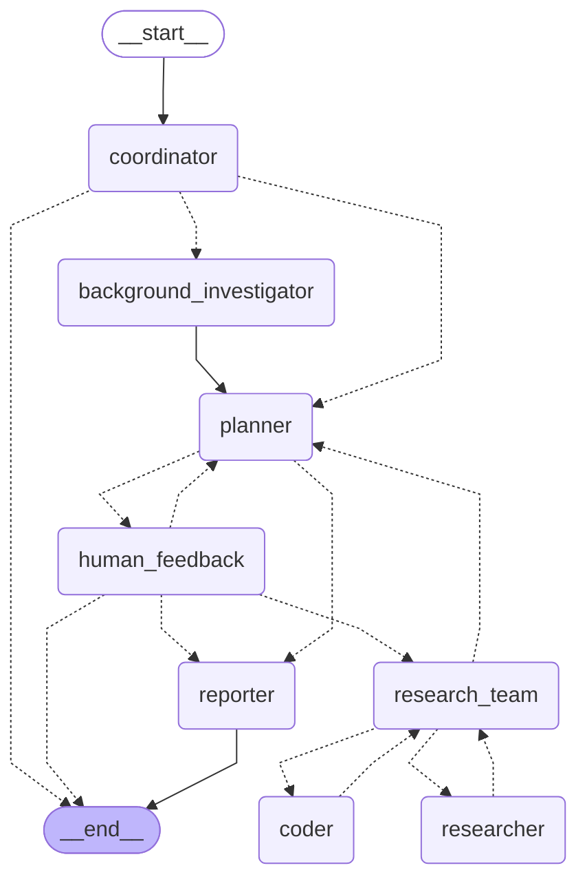

# Deer Flow 工作流程图

## 概述
这是Deer Flow项目的LangGraph工作流程图，展示了整个研究流程的节点和连接关系。

## 流程图

## 节点说明

### 主要节点
- **coordinator**: 协调器节点，负责与用户交互并确定研究方向
- **background_investigator**: 背景调研节点，进行初步的背景信息收集
- **planner**: 规划器节点，生成详细的研究计划
- **human_feedback**: 人工反馈节点，等待用户审核和确认计划
- **research_team**: 研究团队节点，协调研究任务的执行
- **researcher**: 研究员节点，执行具体的研究任务
- **coder**: 编程员节点，执行代码分析和处理任务
- **reporter**: 报告员节点，生成最终的研究报告

### 流程说明
1. 工作流从coordinator节点开始
2. 根据配置决定是否进行背景调研
3. 进入planner节点生成研究计划
4. 通过human_feedback节点获取用户确认
5. 进入research_team协调研究任务
6. 根据计划类型分发到researcher或coder节点
7. 最终由reporter节点生成报告

## 状态管理
工作流使用State类管理状态，包含以下关键字段：
- locale: 用户语言环境
- research_topic: 研究主题
- observations: 观察结果列表
- resources: 资源列表
- current_plan: 当前计划
- final_report: 最终报告

---
*此图由LangGraph自动生成*
